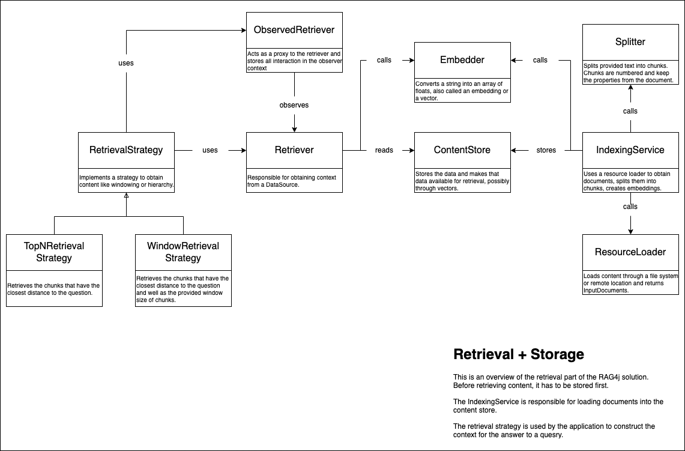
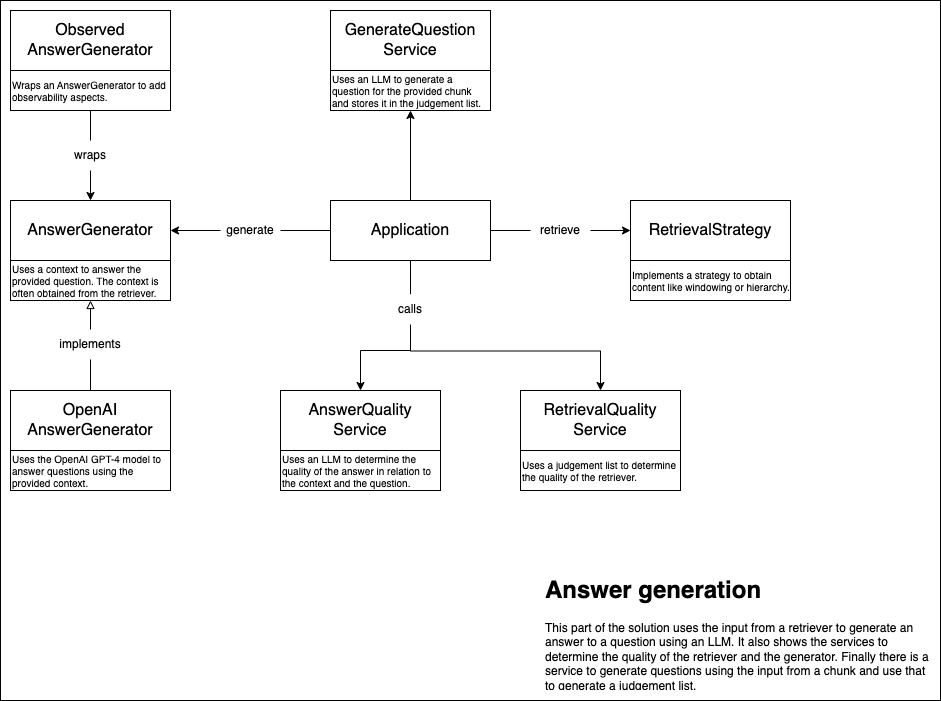

# Overview of the solution

## The retriever and the content store
An important part of the Retrieval Augmented Generation (RAG) system is the retriever. The retriever is responsible for retrieving relevant chunks from a large corpus of documents. Use the RetrievalStrategy to construct a context from the retrieval output. The context size is influenced by the chunk size, the amount of chunks to use, and the retrieval strategy. The Top-N retrieval strategy just returns the number of requested chunks as the context. The window retrieval strategy uses a window of chunks around the matched chunk from the same document.

To be able to retrieve chunks from a corpus, the corpus needs to be indexed. The iIndexingService uses a ResourceLoader to load the content. With a splitter and an embedder, vectors are created and stored in the content store.

### Diagram

## The generator and the quality component
The generator is responsible for generating an answer based on the context and the question. The generator uses a model to generate text. In our case we only have the OpenAI LLM. The application uses the retrieval strategy to obtain relevant chunks. The chunks are used to construct the context. The context is provided to the generator together with the question.

The quality component is responsible for determining the quality of the generated text. There is a quality if the answer really answers the question and if the answer is deduced from the context and not made up by the LLM. There is also a retriever quality, this makes use of the generated judgement list to determine the quality of the retrieved chunks.

### Diagram

